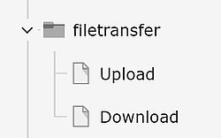
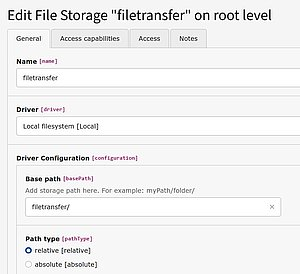
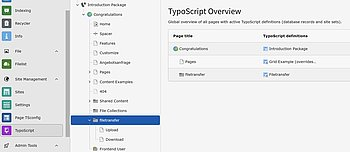
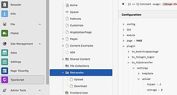
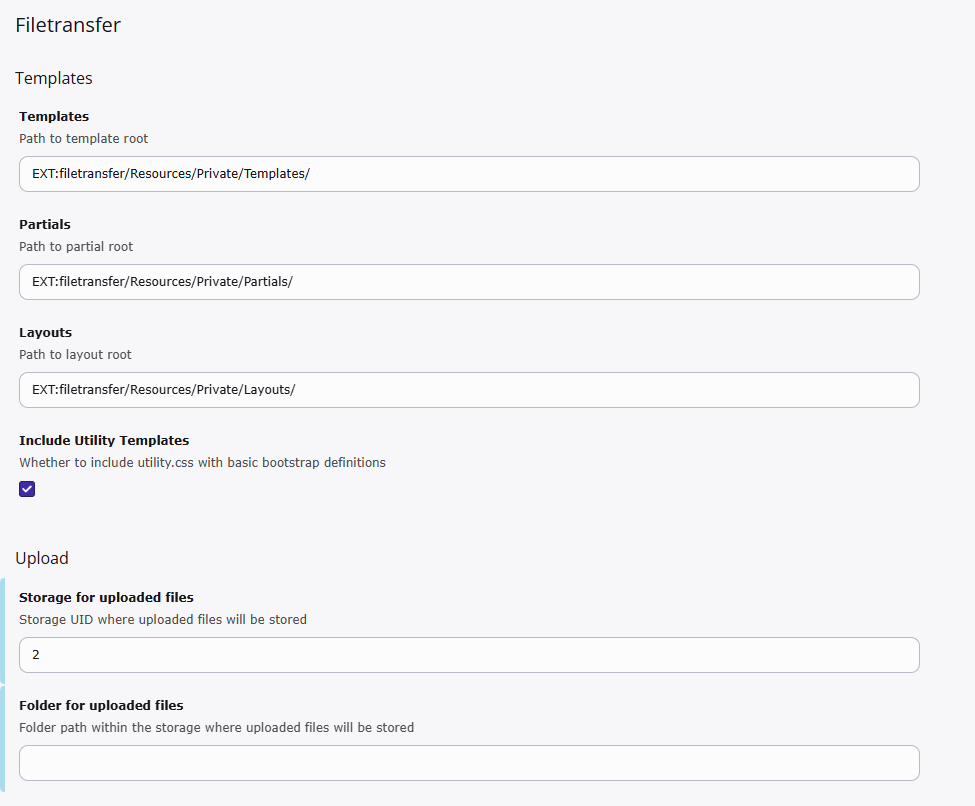
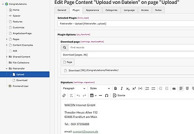
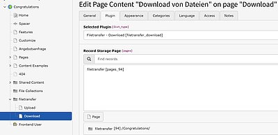
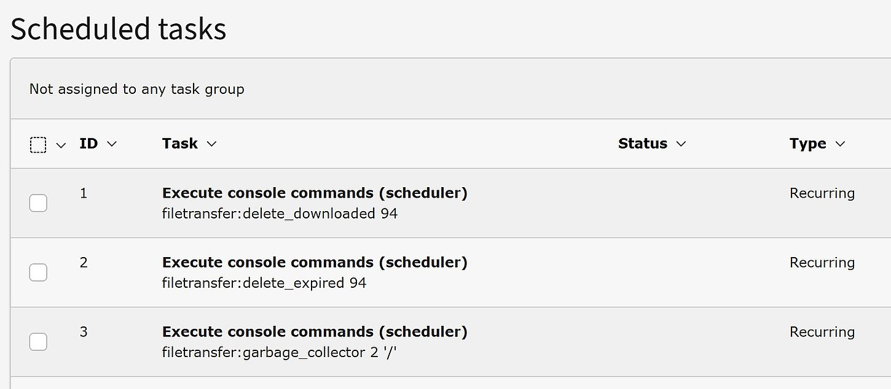

# Installation Instructions for filetransfer
## Step 1: Install extension
1. Legacy
For legacy TYPO3 installation go to the Extension Manager and search for **filetransfer** and install and activate it.

2. Composer
For composer based TYPO3 installation simple type
``composer req wacon/filetransfer``

## Step 2: Create TYPO3 pages and folder
Create a suitable folder and page structure in the backend. For example:

A folder called filetransfer and the two pages Upload and Download underneath it.

### Protect the upload page

It is recommended to set up frontend protection for the “Upload” page. This will allow only registered frontend users with access data to store files on the server.

## Step 3: Configure filestorage

Define a new "file storage" to which the files will later be uploaded.

### Protect the file storage
It is highly recommended to set the access for this file storage to non public.

Also use our [example htaccess protection](../Configuration/htaccess.txt). to avoid direct browser access to all uploaded files.

## Step 4: Include TypoScript (only until version 2)
Include the extension's TypoScript template ("Create an additional TypoScript record") in the created folder.

Define the storage folder and the path in the setup:

    plugin.tx_filetransfer.settings.upload.folder = /
    plugin.tx_filetransfer.settings. upload.storage = 2

")

## Step 4: Include TypoScript (version 3 and above)
Include site set: **Filetransfer**.

Define the storage folder and the path in the setup:

If you have already Bootstrap included, then disable the inclusion of Utility Templates.

## Step 5: Configure upload page
Auf der Uploadseite wird nun das Plugin “Filetransfer - Upload [filetransfer_upload]” eingebunden.

Dabei werden folgende Parameter benötigt:

- die Downloadseite
- eine sinnvolle Signatur für die Mail
- der Ablageort auf dem Server (Filestorage bzw. Verzeichnis)

## Step 6: Configure download page

The plugin “Filetransfer - Download [filetransfer_download]” is integrated on the download page. All you have to do is specify the directory.

## Step 7: Configure scheduler
To ensure that files and old data are deleted from the server, three scheduler tasks must be created:

- With "delete_downloaded" all files and data that have reached their download limit are deleted (specify the ID of the folder "filetransfer", as this is where the records are located).
- With "delete_expired" all files and data whose expiration time has been reached are deleted (specify the ID of the folder "filetransfer", as this is where the records are located).
- With "garbage_collector" all files for which there is no corresponding data record are deleted (specify the ID of the folder)

